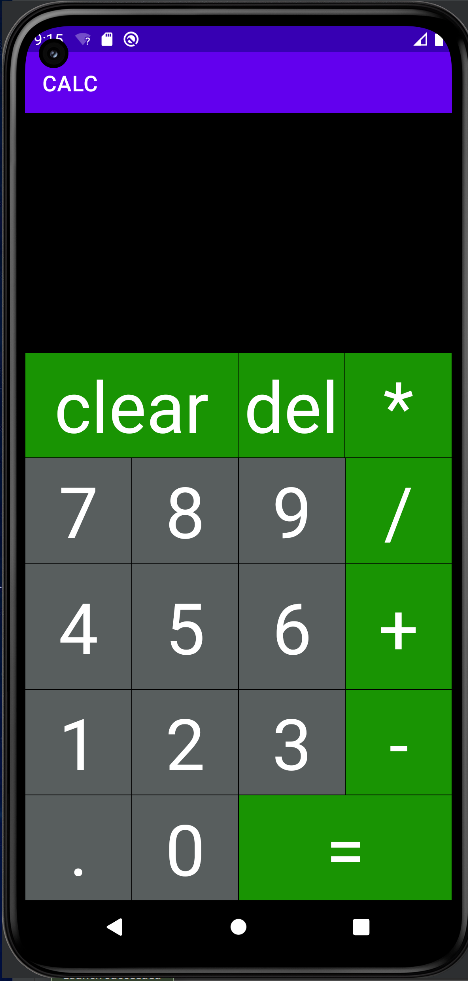
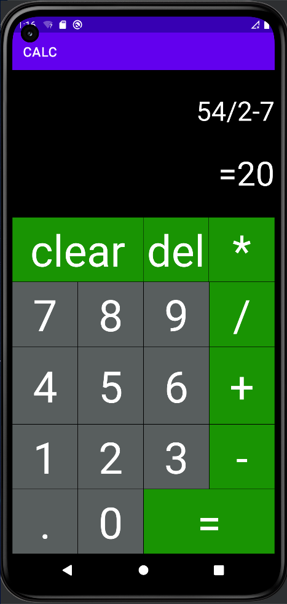

МИНИСТЕРСТВО НАУКИ И ВЫСШЕГО ОБРАЗОВАНИЯ
РОССИЙСКОЙ ФЕДЕРАЦИИ
ФЕДЕРАЛЬНОЕ ГОСУДАРСТВЕННОЕ БЮДЖЕТНОЕ
ОБРАЗОВАТЕЛЬНОЕ УЧРЕЖДЕНИЕ ВЫСШЕГО ОБРАЗОВАНИЯ
«САХАЛИНСКИЙ ГОСУДАРСТВЕННЫЙ УНИВЕРСИТЕТ»

      

Институт естественных наук и техносферной безопасности Кафедра информатики Чагочкин Никита

   

 «Простой Калькулятор на языке Kotlin». 01.03.02 Прикладная математика и информатика

            

Научный руководитель 
Соболев Евгений Игоревич

   

г. Южно-Сахалинск 2023 г.

***
# 
Решение 

## Основной слой вертикальный, на нем располагаются элементы TextView для ввода/вывода данных. Для кнопок использовал тоже TextView сгрупировав их в ряды по 4 штуки
## Написал 2 функции: одну для ввода цифр и вторую для ввода математических знаков. При вводе знаков проверяю на корректность. Для каждой кнопки установил слушателя, который вызывает функцию.
## Для выполнения математических операций использовал библиотеку exp4j - https://github.com/fasseg/exp4j/
# XML
            <LinearLayout xmlns:android="http://schemas.android.com/apk/res/android"
                xmlns:app="http://schemas.android.com/apk/res-auto"
                xmlns:tools="http://schemas.android.com/tools"
                android:id="@+id/res"
                android:layout_width="match_parent"
                android:layout_height="match_parent"
                android:background="@android:color/background_dark"
                android:orientation="vertical"
                tools:context=".MainActivity">

                <LinearLayout
                    android:layout_width="match_parent"
                    android:layout_height="wrap_content"
                    android:layout_weight="2"
                    android:orientation="vertical">

                    <TextView
                        android:id="@+id/math_operation"
                        style="@style/textView"
                        android:layout_width="match_parent"
                        android:layout_weight="2"
                        android:gravity="center"
                        android:textSize="40sp"

                        />

                    <TextView
                        android:id="@+id/math_result"
                        style="@style/textView"
                        android:layout_width="match_parent"
                        android:layout_weight="1"
                        android:textSize="50sp" />

                </LinearLayout>

                <LinearLayout
                    android:layout_width="match_parent"
                    android:layout_height="wrap_content"
                    android:layout_weight="10"
                    android:orientation="vertical">

                    <LinearLayout
                        android:layout_width="match_parent"
                        android:layout_height="1sp"
                        android:layout_weight="1"
                        android:orientation="horizontal">

                        <TextView
                            android:id="@+id/button_clear"
                            style="@style/ActionButton"
                            android:layout_weight="2"

                            android:text="clear" />

                        <TextView
                            android:id="@+id/button_del"
                            style="@style/ActionButton"

                            android:text="del" />

                        <TextView
                            android:id="@+id/button_mult"
                            style="@style/ActionButton"

                            android:text="*" />

                    </LinearLayout>

                    <LinearLayout
                        android:layout_width="match_parent"
                        android:layout_height="1sp"
                        android:layout_weight="1"
                        android:orientation="horizontal">

                        <TextView
                            android:id="@+id/button_7"
                            style="@style/NumberButton"
                            android:text="7" />

                        <TextView
                            android:id="@+id/button_8"
                            style="@style/NumberButton"
                            android:text="8" />

                        <TextView
                            android:id="@+id/button_9"
                            style="@style/NumberButton"
                            android:text="9" />

                        <TextView
                            android:id="@+id/button_div"
                            style="@style/ActionButton"

                            android:text="/" />
                    </LinearLayout>

                    <LinearLayout
                        android:layout_width="match_parent"
                        android:layout_height="1sp"
                        android:layout_weight="1.2"
                        android:orientation="horizontal">

                        <TextView
                            android:id="@+id/button_4"
                            style="@style/NumberButton"
                            android:text="4" />

                        <TextView
                            android:id="@+id/button_5"
                            style="@style/NumberButton"
                            android:text="5" />

                        <TextView
                            android:id="@+id/button_6"
                            style="@style/NumberButton"
                            android:text="6" />

                        <TextView
                            android:id="@+id/button_sum"
                            style="@style/ActionButton"
                            android:text="+" />
                    </LinearLayout>

                    <LinearLayout
                        android:layout_width="match_parent"
                        android:layout_height="1sp"
                        android:layout_weight="1"
                        android:orientation="horizontal">

                        <TextView
                            android:id="@+id/button_1"
                            style="@style/NumberButton"
                            android:text="1" />

                        <TextView
                            android:id="@+id/button_2"
                            style="@style/NumberButton"
                            android:text="2" />

                        <TextView
                            android:id="@+id/button_3"
                            style="@style/NumberButton"
                            android:text="3" />

                        <TextView
                            android:id="@+id/button_minus"
                            style="@style/ActionButton"
                            android:text="-" />
                    </LinearLayout>

                    <LinearLayout
                        android:layout_width="match_parent"
                        android:layout_height="1sp"
                        android:layout_weight="1"
                        android:orientation="horizontal">

                        <TextView
                            android:id="@+id/button_point"
                            style="@style/NumberButton"
                            android:text="." />

                        <TextView
                            android:id="@+id/button_0"
                            style="@style/NumberButton"
                            android:text="0" />

                        <TextView
                            android:id="@+id/button_result"

                            style="@style/ActionButton"
                            android:layout_weight="2"
                            android:text="=" />

                    </LinearLayout>

                </LinearLayout>
            </LinearLayout>

***
# ActivityMain.kt
        class MainActivity : AppCompatActivity() {

            @SuppressLint("MissingInflatedId")
            override fun onCreate(savedInstanceState: Bundle?) {
                super.onCreate(savedInstanceState)
                setContentView(R.layout.activity_main)
                findViewById<TextView>(R.id.button_mult).setOnClickListener{setSignFields("*")}
                findViewById<TextView>(R.id.button_div).setOnClickListener{setSignFields("/")}
                findViewById<TextView>(R.id.button_sum).setOnClickListener{setSignFields("+")}
                findViewById<TextView>(R.id.button_minus).setOnClickListener{setSignFields("-")}
                findViewById<TextView>(R.id.button_point).setOnClickListener {setSignFields(".") }
                findViewById<TextView>(R.id.button_0).setOnClickListener{setDigitFields("0")}
                findViewById<TextView>(R.id.button_1).setOnClickListener{setDigitFields("1")}
                findViewById<TextView>(R.id.button_2).setOnClickListener{setDigitFields("2")}
                findViewById<TextView>(R.id.button_3).setOnClickListener{setDigitFields("3")}
                findViewById<TextView>(R.id.button_4).setOnClickListener{setDigitFields("4")}
                findViewById<TextView>(R.id.button_5).setOnClickListener{setDigitFields("5")}
                findViewById<TextView>(R.id.button_6).setOnClickListener{setDigitFields("6")}
                findViewById<TextView>(R.id.button_7).setOnClickListener{setDigitFields("7")}
                findViewById<TextView>(R.id.button_8).setOnClickListener{setDigitFields("8")}
                findViewById<TextView>(R.id.button_9).setOnClickListener{setDigitFields("9")}

                findViewById<TextView>(R.id.button_del).setOnClickListener{
                    findViewById<TextView>(R.id.math_operation).text=findViewById<TextView>(R.id.math_operation).text.dropLast(1)
                }
                findViewById<TextView>(R.id.button_clear).setOnClickListener {
                    findViewById<TextView>(R.id.math_operation).text=""
                    findViewById<TextView>(R.id.math_result).text=""
                }

                findViewById<TextView>(R.id.button_result).setOnClickListener {
                    try {
                        val exp=ExpressionBuilder(findViewById<TextView>(R.id.math_operation).text.toString()).build()
                        val result=exp.evaluate()

                        val longresult=result.toLong()
                        if(result==longresult.toDouble()){
                            findViewById<TextView>(R.id.math_result).text="=${longresult.toString()}"
                        }else{
                            findViewById<TextView>(R.id.math_result).text="=${result.toString()}"
                        }

                    }catch (e:java.lang.Exception){
                        Log.d("Error","Message: ${e.message}")
                    }
                }
            }

            //Добавляем цифру
            fun setDigitFields(str:String){
                findViewById<TextView>(R.id.math_operation).append(str)
            }

            //Добавляем знак и проверям что-бы они не повторялись
            fun setSignFields(str:String){
                if(findViewById<TextView>(R.id.math_operation).text.length==0){
                    return
                }
                val lastChar=findViewById<TextView>(R.id.math_operation).text[findViewById<TextView>(R.id.math_operation).text.length-1].toString()
                if(str=="."){
                    if(lastChar=="-"||lastChar=="+"||lastChar=="*"||lastChar=="/"||lastChar=="."){
                        return
                    }
                    val text=findViewById<TextView>(R.id.math_operation).text.toString()
                    val count=text.length-1
                    if(count==-1){return}
                    for(i in count downTo  0 ){
                        if(text[i]=='.'){
                            return
                        }
                        if(text[i]=='+'||text[i]=='-'||text[i]=='*'||text[i]=='/'){
                            findViewById<TextView>(R.id.math_operation).append(str)
                            return
                        }
                    }
                }
                if(lastChar=="-"||lastChar=="+"||lastChar=="*"||lastChar=="/"||lastChar=="."){
                    if(lastChar==str){
                        return
                    }
                    else{
                        findViewById<TextView>(R.id.math_operation).text=findViewById<TextView>(R.id.math_operation).text.dropLast(1)
                    }
                }

                findViewById<TextView>(R.id.math_operation).append(str)
            }

        }

        

